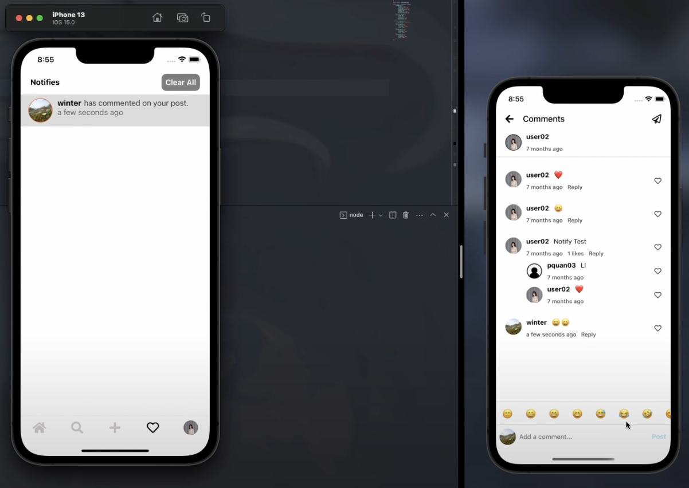

# SocialApp

SocialApp is a social networking application built with React Native Expo on the client side and Node.js, Express.js, and MongoDB on the server side. TypeScript is used throughout the project to enhance code quality and maintainability. Real-time communication is facilitated by Socket.IO.

## Technologies Used

| **Client Side**                                 | **Server Side**                                 |
|--------------------------------------------------|-------------------------------------------------|
| [Expo](https://docs.expo.dev/)                   | [Node.js](https://nodejs.org/)                  |
| [React Native](https://reactnative.dev/)         | [Express.js](https://expressjs.com/)            |
| [Redux](https://redux.js.org/)                   | [MongoDB](https://www.mongodb.com/)             |
| [TypeScript](https://www.typescriptlang.org/)    | [TypeScript](https://www.typescriptlang.org/)  |
| [Socket.IO](https://socket.io/)                  | [Socket.IO](https://socket.io/)                 |

#  Screens

| Screen          | Description                                                                         | Screenshot                                     |
|-----------------|-------------------------------------------------------------------------------------|------------------------------------------------|
| Welcome         | Provides a warm introduction to new users, inviting them to explore the app or log in. |                  |
| Login           | Allows users to securely log into their accounts, providing a smooth authentication process. |                      |
| Signup          | Enables new users to create accounts and join the SocialApp community.                 |                    |
| Home            | Scroll through a personalized feed of posts from friends and accounts followed.             |                        |
| Comment         | Allows users to view and add comments to a specific post, fostering engagement and interaction. |               |
| Discovery       | Combines both "Explore" and "Search User," allowing users to discover new content and find/connect with other users. |         |
| Upload Image    | Enables users to select and upload images when creating a new post.                    |       |
| Write Content   | Lets users add captions and text content when creating a new post.                     |    |
| Notification    | Keeps users informed about likes, comments, and new followers, enhancing the social experience. |  |
| Profile         | Showcases the user's profile, including posts, followers, and customization options.  |                  |

<!-- Include additional screens as needed -->

